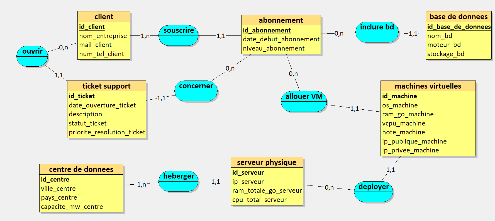

# ☁️ Conception d'un Système d'Information : Fournisseur Cloud (IaaS / PaaS)

Ce dépôt contient la **Partie 1** du mini-projet de conception et développement de base de données (Module T1503N). 

L'objectif de cette première phase est de modéliser le système d'information d'un **fournisseur de services de Cloud Computing** (inspiré de Microsoft Azure et OVHcloud), en analysant les besoins métiers pour aboutir à un Modèle Conceptuel de Données (MCD) robuste et normalisé. Ce domaine métier implique la gestion complexe d'infrastructures physiques (Data Centers, serveurs) allouées dynamiquement sous forme de ressources virtuelles (VM, BDD) aux clients.

---

## 📑 Sommaire
- [Étape 1 : Analyse des besoins](#-étape-1--analyse-des-besoins)
  - [Génération des besoins via IAG (Prompt)](#génération-des-besoins-via-iag-prompt)
  - [Règles de Gestion Métier](#règles-de-gestion-métier)
  - [Dictionnaire de Données Brutes](#dictionnaire-de-données-brutes)
- [Étape 2 : Modèle Conceptuel de Données (MCD)](#-étape-2--modèle-conceptuel-de-données-mcd)
  - [Diagramme MCD](#diagramme-mcd)
  - [Justification des choix de modélisation (Modélisation Avancée)](#justification-des-choix-de-modélisation-modélisation-avancée)

---

## 🔍 Étape 1 : Analyse des besoins

### Génération des besoins via IAG (Prompt)
Pour simuler la collecte des besoins auprès du métier, nous avons conçu un prompt basé sur le **framework RICARDO** (Rôle, Instructions, Contexte, Contraintes, Références, Désiré, Objectifs).

<b>👉 Cliquer ici pour voir le prompt utilisé</b>

 

> Tu travailles dans le domaine du Cloud Computing et de l'hébergement d'infrastructures informatiques. Ton entreprise a comme activité de fournir des ressources de calcul, des bases de données managées et des espaces de stockage à la demande pour d'autres entreprises. C’est une entreprise comme Microsoft Azure, AWS, Google Cloud ou OVHcloud. Les données ont été collectées sur les clients professionnels, les centres de données physiques, les serveurs, les machines virtuelles déployées, les abonnements de facturation et les tickets de support technique. Inspire-toi du site web officiel et de la documentation technique de Microsoft Azure.
>
> Ton entreprise veut appliquer MERISE pour concevoir un système d'information. Tu es chargé de la partie analyse, c’est-à-dire de collecter les besoins auprès de l’entreprise. Elle a fait appel à un étudiant en ingénierie informatique pour réaliser ce projet, tu dois lui fournir les informations nécessaires pour qu’il applique ensuite lui-même les étapes suivantes de conception et développement de la base de données.
>
> D’abord, établis les règles de gestions des données de ton entreprise, sous la forme d'une liste à puce. Elle doit correspondre aux informations que fournit quelqu’un qui connaît le fonctionnement de l’entreprise, mais pas comment se construit un système d’information.
>
> Ensuite, à partir de ces règles, fournis un dictionnaire de données brutes avec les colonnes suivantes, regroupées dans un tableau : signification de la donnée, type, taille en nombre de caractères ou de chiffres. Il doit y avoir entre 25 et 35 données. Il sert à fournir des informations supplémentaires sur chaque donnée (taille et type) mais sans a priori sur comment les données vont être modélisées ensuite.
>
> Fournis donc les règles de gestion et le dictionnaire de données.

### Règles de Gestion Métier
Suite à l'analyse, voici les règles opérationnelles qui régissent le fonctionnement de notre infrastructure d'hébergement :

- **RG01** : Un client professionnel peut souscrire à un ou plusieurs abonnements de facturation.
- **RG02** : Chaque abonnement appartient à un seul client et définit un niveau de service (ex: Standard, Premium).
- **RG03** : Notre infrastructure s'appuie sur plusieurs centres de données (Data Centers) répartis dans différentes villes et pays.
- **RG04** : Un centre de données héberge de nombreux serveurs physiques.
- **RG05** : Un serveur physique ne peut se trouver que dans un seul centre de données à la fois.
- **RG06** : Sur un même serveur physique, notre hyperviseur peut déployer plusieurs machines virtuelles (VM).
- **RG07** : Chaque machine virtuelle est allouée à un abonnement client spécifique (qui prend en charge la facturation).
- **RG08** : Une machine virtuelle utilise un système d'exploitation donné (Windows Server, Ubuntu, RedHat, etc.) et se voit allouer une certaine quantité de ressources (RAM et vCPU).
- **RG09** : Dans le cadre des services PaaS, un abonnement peut également inclure une ou plusieurs bases de données managées (SQL ou NoSQL).
- **RG10** : En cas de problème technique ou administratif, un client peut ouvrir des tickets de support.
- **RG11** : Chaque ticket de support est rattaché à un client spécifique et concerne un abonnement précis.
- **RG12** : Un ticket de support possède un niveau de priorité (Basse, Normale, Haute, Critique) et un statut d'avancement.

### Dictionnaire de Données Brutes

| Code Donnée | Signification | Type | Taille |
| :--- | :--- | :--- | :--- |
| `id_client` | Identifiant unique du client | Entier | 8 |
| `nom_entreprise` | Nom de l'entreprise cliente | Alphanumérique | 100 |
| `mail_client` | Adresse e-mail de contact du client | Alphanumérique | 150 |
| `num_tel_client` | Numéro de téléphone du client | Alphanumérique | 15 |
| `id_abonnement` | Numéro d'identification de l'abonnement | Entier | 10 |
| `date_debut_abonnement` | Date de création de l'abonnement | Date | 10 |
| `niveau_abonnement` | Niveau de service de l'abonnement | Alphanumérique | 20 |
| `id_centre` | Code d'identification du centre de données | Alphanumérique | 10 |
| `ville_centre` | Ville d'implantation du centre de données | Alphanumérique | 50 |
| `pays_centre` | Pays d'implantation du centre de données | Alphanumérique | 50 |
| `capacite_mw_centre` | Capacité électrique du centre de données (en MW) | Entier | 4 |
| `id_serveur` | Numéro d'identification du serveur physique | Entier | 12 |
| `ip_serveur` | Adresse IP de gestion du serveur physique | Alphanumérique | 15 |
| `ram_totale_go_serveur` | Capacité totale en RAM du serveur (en Go) | Entier | 4 |
| `cpu_total_serveur` | Nombre total de cœurs CPU du serveur physique | Entier | 4 |
| `id_machine` | Numéro d'identification de la machine virtuelle | Entier | 12 |
| `hote_machine` | Nom d'hôte de la machine virtuelle | Alphanumérique | 50 |
| `ip_publique_machine` | Adresse IP publique de la machine virtuelle | Alphanumérique | 15 |
| `ip_privee_machine` | Adresse IP privée de la machine virtuelle | Alphanumérique | 15 |
| `os_machine` | Nom du système d'exploitation de la VM | Alphanumérique | 30 |
| `ram_go_machine` | RAM allouée à la machine virtuelle (en Go) | Entier | 4 |
| `vcpu_machine` | Nombre de vCPU alloués à la VM | Entier | 3 |
| `id_base_de_donnees` | Identifiant de la base de données managée | Entier | 12 |
| `nom_bd` | Nom de la base de données managée | Alphanumérique | 50 |
| `moteur_bd` | Moteur de la base (ex: PostgreSQL, SQL Server) | Alphanumérique | 20 |
| `stockage_bd` | Espace de stockage alloué à la BDD (en Go) | Entier | 6 |
| `id_ticket` | Numéro d'identification du ticket de support | Entier | 10 |
| `date_ouverture_ticket` | Date et heure d'ouverture du ticket | Date/Heure | 16 |
| `description` | Description du problème rencontré | Alphanumérique | 2000 |
| `statut_ticket` | Statut d'avancement du ticket | Alphanumérique | 20 |
| `priorite_resolution_ticket` | Priorité de résolution du ticket | Alphanumérique | 15 |

---

## 🛠️ Étape 2 : Modèle Conceptuel de Données (MCD)

Le Modèle Conceptuel de Données a été réalisé afin de représenter logiquement la structure de notre système d'information, en respectant la 3ème Forme Normale (3FN).

### Diagramme MCD

### Justification des choix de modélisation (Modélisation Avancée)
Pour modéliser fidèlement la réalité de l'infrastructure cloud et répondre aux exigences techniques de conception avancée, nous avons intégré les concepts suivants :

1. **Association n-aire (ternaire) `allouer VM`** : 
   Cette association relie simultanément trois entités : `abonnement`, `machines virtuelles` et un contexte temporel/logique (modélisé par l'entité virtuelle de l'association). Cela permet de tracer le fait qu'une machine virtuelle est allouée dans le périmètre strict d'un abonnement précis, gérant ainsi la liaison complexe entre les ressources de calcul déployées et la facturation client.

2. **Entités Faibles (Identification relative)** :
   Une grande partie de l'infrastructure Cloud repose sur des liens de dépendance existentielle forte, ce qui se traduit par une chaîne d'identifications relatives :
   - Le `ticket support` est une entité faible par rapport au `client`. L'association `ouvrir` (cardinalité 1,1 côté ticket) montre qu'un ticket n'existe que s'il est rattaché à un client. Son identifiant `id_ticket` est relatif à l'`id_client`.
   - La `base de donnees` (PaaS) est une entité faible, existant uniquement dans le contexte d'un `abonnement`. L'association `inclure bd` (1,1 côté BDD) prouve cette dépendance.
   - Il en va de même pour la topologie matérielle : un `serveur physique` n'existe logiquement que parce qu'il est hébergé (association `heberger` en 1,1) dans un `centre de donnees` parent. La `machines virtuelles` subit le même héritage existentiel vis-à-vis du `serveur physique` via l'association `deployer`.

---

## 👨‍💻 Auteurs
* **Yoann Lehong Cheffson** - [Mon GitHub](https://github.com/Yoannlcf/My-Data-Journey)
* **Alicia Liu** - [Lien GitHub du Binôme](https://github.com/alicialiu0507)]
